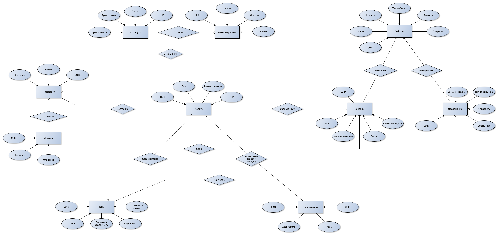

### **1. Название проекта**  
**SensorTrack Pro**  

---

### **2. Краткое описание идеи проекта**  
Система предназначена для мониторинга движущихся объектов (транспорт, грузы, техника) с помощью датчиков в реальном времени. Сервис анализирует данные телеметрии, отслеживает пересечение зон и автоматически генерирует оповещения при критических событиях. Решение позволяет оптимизировать логистику, повысить безопасность и сократить риски потери объектов.  

---

### **3. Краткое описание предметной области**  
Проект охватывает области логистики, транспорта и IoT-мониторинга. Система актуальна для компаний, управляющих автопарками, грузоперевозками или спецтехникой, где требуется контроль местоположения, состояния объектов и соблюдение маршрутов. Интеграция с датчиками и гибкие настройки зон позволяют адаптировать сервис под разные сценарии использования.  

---

### **4. Анализ аналогичных решений**  

| **Критерий**       | **SensorTrack Pro**                     | **Аналог 1 (FleetMind)**       | **Аналог 2 (GeoGuard)**        | **Аналог 3 (TrackFlow)**       |  
|---------------------|-----------------------------------------|---------------------------------|---------------------------------|--------------------------------|  
| **Гибкость зон**    | Поддержка кругов, прямоугольников      | Только круги                   | Прямоугольники                  | Статичные зоны                 |  
| **Типы метрик**     | Кастомизируемые метрики (ключ-значение)| Фиксированный набор метрик     | Ограниченные метрики            | Базовые метрики                |  
| **Ролевая модель**  | 3 роли + гибкие права доступа          | 2 роли (админ/оператор)        | 1 роль (админ)                  | 2 роли без настройки прав      |  

---

### **5. Обоснование целесообразности и актуальности**  
Рост числа IoT-устройств и необходимость автоматизации логистических процессов делают проект востребованным. Текущие решения часто ограничены в гибкости настройки зон и метрик, что критично для нишевых задач (например, мониторинг температурных условий при перевозке медикаментов). SensorTrack Pro закрывает эти пробелы, предлагая кастомизацию под нужды бизнеса.  

---

### **6. Описание акторов**  
- **Администратор**: Управляет пользователями, объектами, зонами и настройками системы.  
- **Оператор**: Просматривает данные датчиков, события и маршруты в реальном времени.  
- **Аналитик**: Формирует отчеты, анализирует исторические данные и тенденции.  

---

### **7. Use-Case диаграмма (текстовое описание)**  

---

### **8. ER-диаграмма сущностей**  

---

### **9. Пользовательские сценарии**  

**Сценарий 1: Оператор получает оповещение о выходе объекта из зоны**  
1. Система фиксирует событие пересечения границы зоны.  
2. Оповещение отображается в интерфейсе оператора.  
3. Оператор проверяет данные объекта (местоположение, скорость).  
4. Отправляет уведомление водителю через интеграцию с мессенджером.  

**Сценарий 2: Администратор добавляет новую зону**  
1. Выбирает тип зоны (круг/прямоугольник).  
2. Указывает параметры (радиус или координаты углов).  
3. Назначает зону объектам через `ObjectZones`.  
4. Сохраняет изменения; система начинает мониторинг.  

**Сценарий 3: Аналитик формирует отчет по расходу топлива**  
1. Выбирает метрику "fuel_level" из `Metrics`.  
2. Задает временной диапазон (последний месяц).  
3. Система генерирует график потребления топлива.  
4. Аналитик экспортирует отчет в PDF.  

---

### **10. Формализация ключевых бизнес-процессов (BPMN)**  

---

### 11. Тип приложения и стек технологий
Описание типа приложения и выбранного технологического стека
Для проекта SensorTrack Pro выбран тип приложения Web MPA (Multi-Page Application) с использованием следующего технологического стека:

Язык программирования: Python 3
Backend фреймворк: FastAPI - высокопроизводительный асинхронный веб-фреймворк для создания API
ORM: SQLAlchemy - для работы с базами данных через объектно-ориентированный подход
База данных: PostgreSQL - реляционная СУБД с поддержкой геопространственных данных (PostGIS)
Frontend: HTML, CSS
Контейнеризация: Docker для упрощения развертывания

### 12. Верхнеуровневое разбиение на компоненты

### 13. Диаграмма классов

